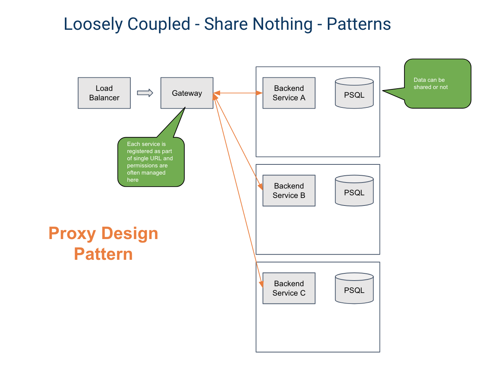

+++
title = "BiFrost"
api_url = "bifrost"
aliases = [
	"/walhall/bifrost"
]
+++

# BiFrost

## Overview

BiFrost is a core authentication layer for microservice architectures in [Walhall](/walhall). It includes the following features: 

-  **API gateway:** Combines all endpoints from the app's [logic modules](/library/logic-modules) into a single API.
-  **User & permissions management:** Provides a simple [role-based access control (RBAC) model](https://en.wikipedia.org/wiki/Role-based_access_control) for managing permissions to entities in your app.
-  **Data mesh:** A join table for aggregating and sharing data between logic modules.

You can choose whether or not to include BiFrost in your app during the creation process in the Walhall UI.

## Microservice architecture patterns with BiFrost

BiFrost makes it possible to implement a variety of common microservice architecture patterns.

### Proxy pattern

You can use BiFrost's **API gateway** to implement a proxy pattern in your microservice architecture. When you create a Walhall app and add your logic modules, BiFrost will run an auto-discovery process to identify all of the endpoints and combine them into a single API. All requests to and from the logic modules will be routed through BiFrost. Authentication is handled with a [JSON Web Token (JWT)](https://jwt.io).

All you need to do to use the API gateway with your logic modules is to ensure that they expose a [Swagger file](https://swagger.io/docs/specification/about/) (`swagger.json`) at the `/docs` endpoint.

### Aggregator pattern

BiFrost includes a **data mesh** that can be used to implement an aggregator pattern. The data mesh is a service in BiFrost running alongside the API gateway that contains a list of logic modules in the app and how they can be joined. It creates a lookup table of each of these connections. Then, the app frontend can query this table for each data type's unique ID, write the individual REST queries for each service, and then pull that service data back into one request object with a join of the data.

### Async pattern

If you would prefer not to use the API gateway or data mesh, you can still use BiFrost in an async pattern. Every app environment in Walhall includes [RabbitMQ](https://www.rabbitmq.com/), and both BiFrost and Walhall include [Celery](http://www.celeryproject.org/). When you add a logic module to your app, Walhall will publish to your app's RabbitMQ feed. The message will be consumed by BiFrost's Celery, and BiFrost will add a new record to the database of logic modules in the app. 

## Permissions model

The BiFrost permissions model follows the RBAC pattern.

Permissions are granted to CoreUsers by their **CoreGroups.** Each CoreGroup can be associated with one or more WorkflowLevels. "Permissions" are defined as the ability to execute [CRUD operations](https://en.wikipedia.org/wiki/Create,_read,_update_and_delete) on WorkflowLevels.

If a CoreGroup is given permissions to a WorkflowLevel, then those permissions will cascade down to all child WorkflowLevels.

By default, all CoreGroups can only have permissions defined to entities within their Organization. You can define a **global CoreGroup** that has permissions to all organizations by setting the `is_global` property to `true`.

### Organization

The Organization is the top-level class of the BiFrost permissions model. Everything contained within an organization---users, groups, and WorkflowLevels---can only be accessed by entities within the organization, with the exception of global CoreGroups (see below).

### CoreUser

A CoreUser is a registered user of a Walhall app. Every CoreUser must belong to a **CoreGroup.**

### CoreGroup

A CoreGroup defines a group of CoreUsers with specific permissions in the context of a given WorkflowLevel (1 or 2).

### WorkflowLevels

BiFrost allows you to define nested data hierarchies in your microservice architecture by using **WorkflowLevels.** There are two types of WorkflowLevels: **WorkflowLevel1** and **WorkflowLevel2.** WorkflowLevel2s can be nested within other WorkflowLevel2s as child objects, but they must always be associated with a parent WorkflowLevel1.

By creating WorkflowLevels for each model in your microservice architecture, you can enable them to share data by implementing their WorkflowLevel UUIDs as foreign keys. 

You can define WorkflowLevels using the [BiFrost API](/api/walhall/bifrost) once you have deployed your Walhall app.

#### Example implementation

Suppose you want to create a microservice application for managing factories that employ a variety of robots to manufacture a variety of products.

-  The **Factory** is the top of the data hierarchy, so the Factory model would be considered the WorkflowLevel1. 
-  Each factory employs a set of **robots,** so the Robot model would be considered a WorkflowLevel2 associated with the "Factory" WorkflowLevel1. 
-  Each robot manufactures a set of **products,** so the Product model would be considered a WorkflowLevel2 with the Robot model as its parent.

Follow these steps to implement this data hierarchy in BiFrost:

1.  Create a **WorkflowLevel1** with the name "Factory" using your app's [POST /workflowlevel1](/api/bifrost/#!/workflowlevel1/workflowlevel1_create) endpoint.
2.  Add the `workflowlevel1_uuid` property to your Factory data model and set the value to the UUID of the Factory WorkflowLevel1 you just created.
3.  Create a **WorkflowLevel2** with the name "Robot" using your app's [POST /workflowlevel2](/api/bifrost/#!/workflowlevel2/workflowlevel2_create) endpoint. Set the value of `workflowlevel1` to the UUID of the Factory WorkflowLevel1.
4.  Add the following properties to your Robot data model:
    -  `workflowlevel1_uuid`: UUID of the Factory WorkflowLevel1.
    -  `workflowlevel2_uuid`: UUID of the Robot WorkflowLevel2.
5.  Create a **WorkflowLevel2** with the name "Product" using your app's [POST /workflowlevel2](/api/bifrost/#!/workflowlevel2/workflowlevel2_create) endpoint. Set the value of `workflowlevel1` to the UUID of your Factory WorkflowLevel1, and set the value of `parent_workflowlevel2` to the UUID of your Robot WorkflowLevel2.
6.  Add the following properties to your Product data model:
    -  `workflowlevel1_uuid`: UUID of the Factory WorkflowLevel1.
    -  `workflowlevel2_uuid`: UUID of the Robot WorkflowLevel2.

Associating your data models with WorkflowLevels enables them to be reused and dynamically swapped out. For example, if some of your factories employ humans to build the same products, you could create a **Human** WorkflowLevel2 and add the Human WorkflowLevel2 UUID as another parent to the Product data model.

<!-- ## Data model using data mesh

TBD -->

## API documentation for your app

As part of the discovery process, BiFrost will combine the Swagger files from all the services and serve the combined API documentation at the `/docs` endpoint of the app via [SwaggerUI](https://swagger.io/tools/swagger-ui/). 
