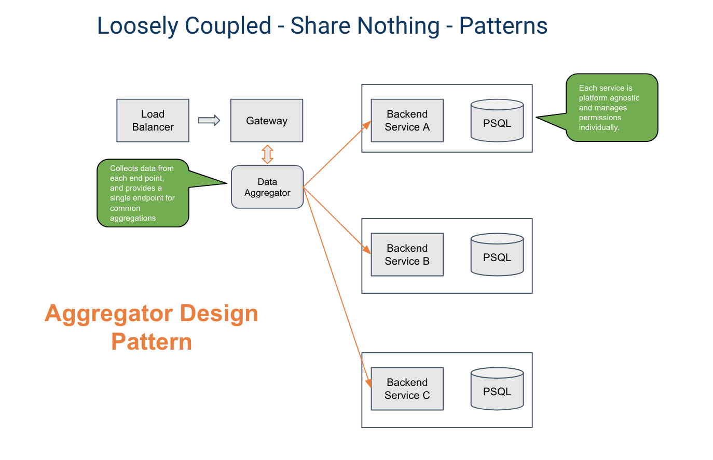

Aggregator pattern
==================

Buildly includes a **data mesh** that can be used to implement an aggregator pattern. The data mesh is a service in Buildly running alongside the API gateway that contains a list of logic modules in the app and how they can be joined. It creates a lookup table of each of these connections. Then, the app frontend can query this table for each data type's unique ID, write the individual REST queries for each service, and then pull that service data back into one request object with a join of the data.
