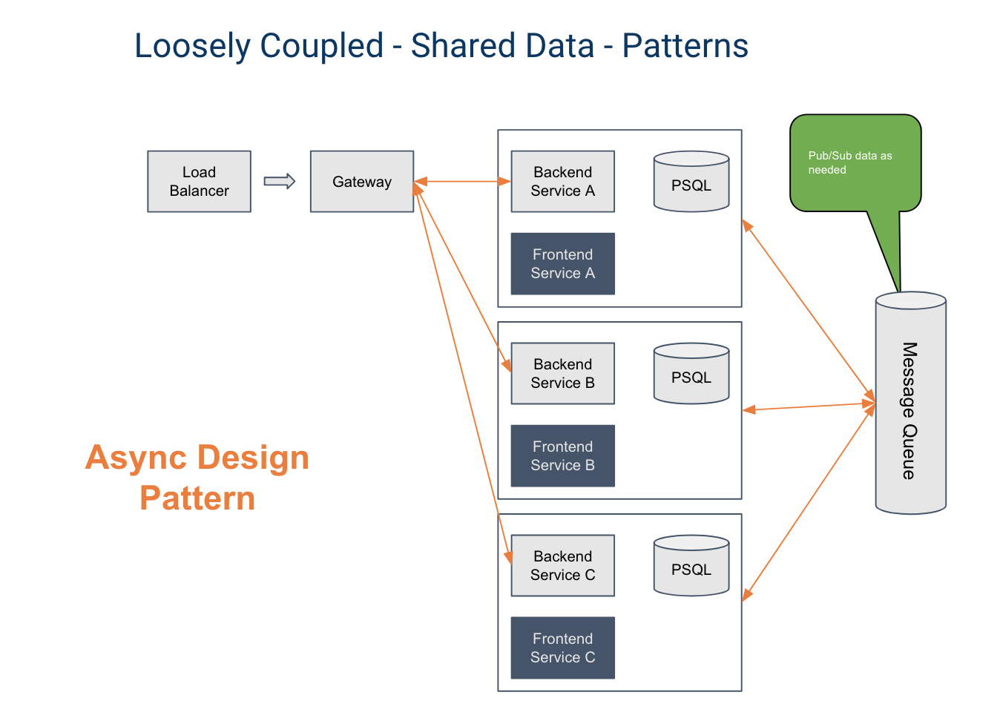

# Async pattern

If you would prefer not to use the API gateway or data mesh, you can still use Buildly in an async pattern. Each service can publish data to a messaging queue like RabbitMQ and subscribe to the data it needs from other services. It requires a bit more upfront configuration for each service but provides the needed data and only the needed data to each endpoint.
